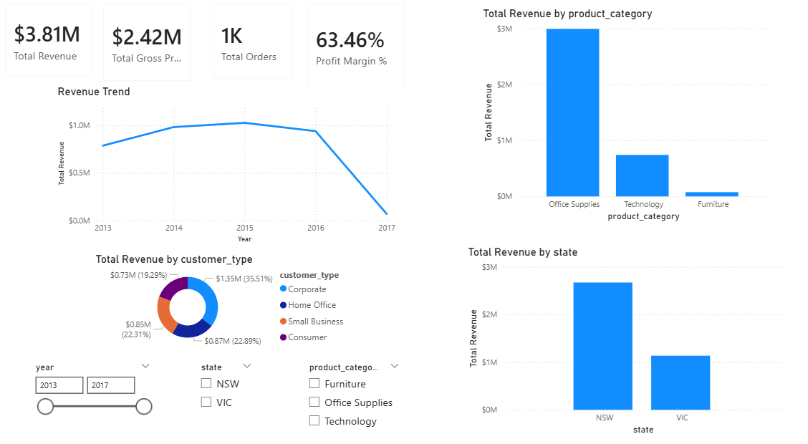
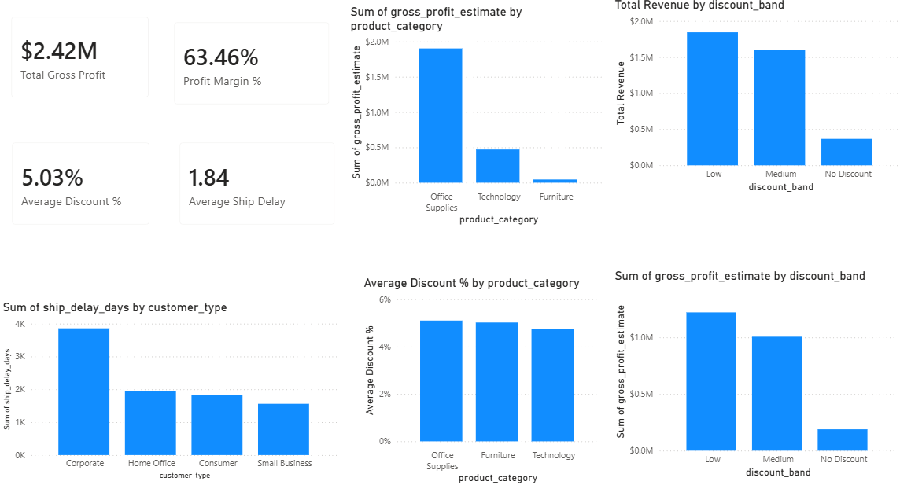
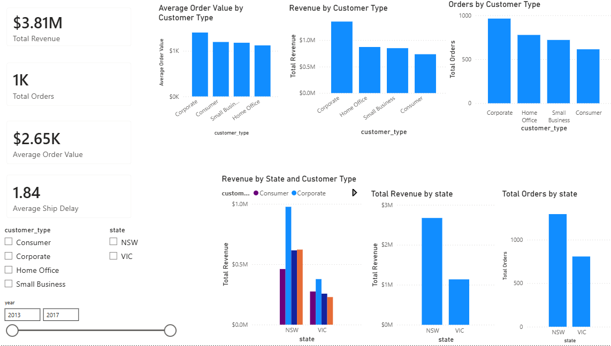

# Sales Analytics Dashboard

## Overview
This project is an end-to-end retail sales analytics workflow built using **Databricks, SQL, and Power BI**. The goal was to take a raw retail sales CSV file, clean and transform it into an analysis-ready dataset, run business-focused SQL analysis, and build an interactive dashboard to track revenue, profitability, discounts, customer segments, and regional performance.

The project simulates a real business intelligence workflow:

1. ingest raw data  
2. clean and standardize it  
3. engineer useful business features  
4. analyze it with SQL  
5. visualize it in Power BI  

This project was built to demonstrate practical skills in:
- data cleaning
- feature engineering
- SQL analysis
- KPI design
- dashboard development
- business storytelling with data

---

## Tools Used

### Databricks
Used as the main data processing environment for loading the raw CSV, inspecting the schema, cleaning fields, transforming the dataset, creating derived columns, and exporting the cleaned output.

### Python / PySpark
Used in Databricks for:
- loading and inspecting the raw data
- selecting and renaming columns
- cleaning date and numeric fields
- handling null values
- creating derived columns such as `year`, `month`, `quarter`, `ship_delay_days`, `unit_margin`, `gross_profit_estimate`, `discount_pct_decimal`, and `discount_band`
- exporting the cleaned dataset to CSV

### SQL
Used in Databricks for business analysis queries, including:
- KPI summary analysis
- revenue trend analysis
- product category performance
- state-level performance
- discount analysis
- customer type analysis

### Power BI
Used for:
- importing the cleaned dataset
- creating visuals and dashboard pages
- building interactive filtering with slicers
- presenting executive, profitability, customer, and regional insights

### DAX
Used in Power BI to create reusable measures such as:
- Total Revenue
- Total Gross Profit
- Total Orders
- Total Units Sold
- Average Order Value
- Profit Margin %
- Average Discount %
- Average Ship Delay
---

## Project Objective
The objective of this project was to transform raw retail sales data into a dashboard that answers key business questions such as:

- How much revenue is the business generating?
- Which product categories perform best?
- Which states drive the most sales?
- How do discounts affect profitability?
- Which customer types are most valuable?
- How long does shipping take on average?

---

## Data Source
The raw dataset used in this project was sourced from Kaggle: Retail Insights: A Comprehensive Sales Dataset. The cleaned analysis-ready dataset (`sales_clean`) was created in Databricks through data cleaning, type conversion, and feature engineering.

### Relevant raw fields included:
- Order No
- Order Date
- Customer Name
- Address
- City
- State
- Customer Type
- Account Manager
- Order Priority
- Product Name
- Product Category
- Product Container
- Ship Mode
- Ship Date
- Cost Price
- Retail Price
- Profit Margin
- Order Quantity
- Sub Total
- Discount %
- Discount $
- Order Total
- Shipping Cost
- Total

The dataset contained **5,000 rows**.

---

## Thought Process and Project Approach

### 1. Start with the business goal, not just the data
Instead of immediately building charts, the project started by thinking about what a sales dashboard should actually answer. The goal was not only to show data visually, but to create a useful business reporting tool.

The main business focus areas were:
- revenue
- profitability
- customer behavior
- discounts
- geography
- shipping performance

### 2. Clean the raw data before visualization
The raw CSV could not be used directly in Power BI because:
- dates were stored as text
- prices and percentages were stored as strings with symbols like `$` and `%`
- some columns were unnecessary for analysis
- the naming format was inconsistent for SQL and BI tools

So the next step was to clean and standardize the data first.

### 3. Create an analysis-ready dataset
Rather than keeping the dataset in its raw form, the goal was to create a clean table that could support:
- SQL aggregation
- dashboard KPIs
- filtering
- time-series analysis
- profitability analysis

This led to the creation of a final cleaned dataset called `sales_clean`.

### 4. Use SQL to answer business questions
Once the cleaned table was ready, SQL was used to generate summary-level insights that would later guide the dashboard design.

### 5. Build dashboard pages around business themes
Instead of putting all charts on one page, the dashboard was split into focused pages:
- Executive Overview
- Discount & Profitability
- Customer & Regional Insights

This made the reporting structure clearer and more realistic.

## Dashboard Screenshots

The following screenshots show the final Power BI dashboard pages built from the cleaned `sales_clean` dataset.

### Executive Overview


### Discount & Profitability


### Customer & Regional Insights


---

## Data Cleaning and Transformation

### Step 1: Load the raw CSV
The raw CSV was loaded into Databricks and converted into a DataFrame for inspection.

This included checking:
- column names
- row count
- schema
- data types

### Initial findings:
- many numeric columns were stored as strings
- date fields were stored as text
- there was an unnecessary `Address` column
- there was an extra `Total` column
- monetary fields contained `$` and `,`
- discount values contained `%`

---

### Step 2: Select relevant columns
Only the fields needed for analysis were kept.

### Kept columns:
- Order No
- Order Date
- Customer Name
- City
- State
- Customer Type
- Account Manager
- Order Priority
- Product Name
- Product Category
- Product Container
- Ship Mode
- Ship Date
- Cost Price
- Retail Price
- Profit Margin
- Order Quantity
- Sub Total
- Discount %
- Discount $
- Order Total
- Shipping Cost

### Dropped fields:
- Address
- Total

`Address` was removed because city and state were enough for this project, and street-level detail was unnecessary.

`Total` was excluded because it was redundant and not required in the cleaned model.

---

### Step 3: Rename columns
The columns were standardized into lowercase snake_case format for cleaner SQL and easier use in Power BI.

### Examples:
- `Order No` → `order_no`
- `Order Date` → `order_date`
- `Customer Name` → `customer_name`
- `Discount %` → `discount_pct`
- `Discount $` → `discount_amt`
- `Shipping Cost` → `shipping_cost`

This made the dataset much easier to work with programmatically.

---

### Step 4: Clean date fields
The raw date fields were originally stored as text in `dd-MM-yyyy` format.

They were converted into proper date values so they could be used for:
- time trend analysis
- date filtering
- year/month/quarter extraction
- shipping delay calculations

### Cleaned date columns:
- `order_date`
- `ship_date`

---

### Step 5: Clean numeric fields
Several columns that should have been numeric were stored as strings because they included formatting symbols.

### Numeric fields cleaned:
- `cost_price`
- `retail_price`
- `profit_margin`
- `order_quantity`
- `sub_total`
- `discount_pct`
- `discount_amt`
- `order_total`
- `shipping_cost`

### Cleaning logic:
- removed `$`
- removed `%`
- removed `,`
- converted to numeric types

### Examples:
- `$4,533.52` → `4533.52`
- `2%` → `2.0`

This step was necessary before any calculations or aggregations could be performed.

---

### Step 6: Handle null values
A null check was performed after cleaning.

The dataset only contained one problematic row involving `order_quantity`, which also caused one null in `gross_profit_estimate`.

Because the issue affected only one row out of 5,000, the row was removed to keep the dataset clean and consistent.

---

### Step 7: Create derived columns
After cleaning the raw fields, several new columns were created to make the dataset more useful for business analysis.

### Time-based features
- `year` — extracted from `order_date`
- `month` — extracted from `order_date`
- `quarter` — extracted from `order_date`

These support time trend analysis.

### Shipping feature
- `ship_delay_days` — calculated as the difference between `ship_date` and `order_date`

This measures operational shipping performance.

### Margin and profit features
- `unit_margin` — calculated as `retail_price - cost_price`
- `gross_profit_estimate` — calculated as `unit_margin * order_quantity`

These support profitability analysis.

### Discount features
- `discount_pct_decimal` — calculated as `discount_pct / 100`
- `discount_band` — grouped discounts into:
  - No Discount
  - Low
  - Medium
  - High

This makes discount analysis easier and more dashboard-friendly.

---

## Final Cleaned Dataset
The final cleaned and enriched table was saved as:

```text
sales_clean
